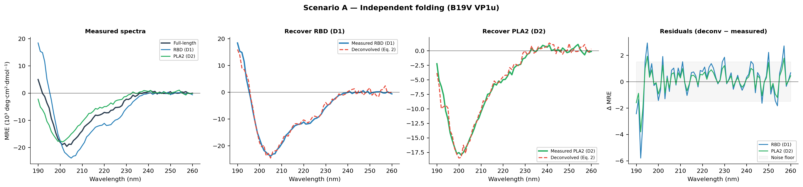
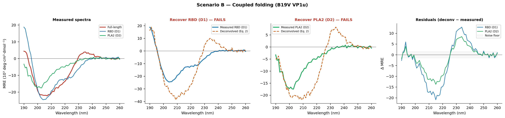
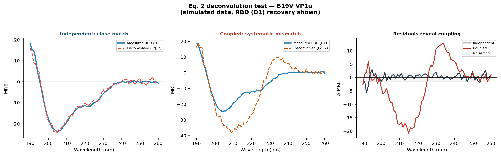
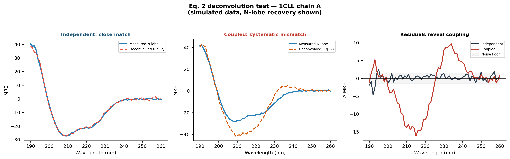

# CD Domain Folding Independence Simulator

Simulates circular dichroism (CD) spectroscopy data to test whether
protein domains fold independently. This approach was used experimentally
in the study of B19 parvovirus VP1u to show that the receptor-binding
domain (RBD) and phospholipase A2 (PLA2) domain fold independently of
each other:

> Lakshmanan, Hull, Berry, Burg, Bothner, McKenna & Agbandje-McKenna.
> *Structural Dynamics and Activity of B19V VP1u during the pHs of Cell
> Entry and Endosomal Trafficking.*
> **Viruses** 2022, 14(9):1922.
> [doi:10.3390/v14091922](https://doi.org/10.3390/v14091922)

This tool simulates what the input and output data of that test look like
when domain independence holds vs. when it doesn't, and generalises the
approach to any protein with a PDB structure.

## The idea

If protein domains fold independently, the full-length CD spectrum is
just the residue-weighted sum of each domain's spectrum. You can test
this by measuring the full-length protein and each domain in isolation,
then algebraically recovering one domain's mean residue ellipticity (MRE)
from the others (Eq. 2 in the paper):

```
MRE_i = (MRE_total × N_total − MRE_j × N_j) / N_i
```

If the recovered spectrum matches the directly measured one, domains fold
independently. If it doesn't, there is inter-domain coupling that changes
the CD when both domains are present together.

## Install

```bash
pip install numpy matplotlib
```

## Quick start

### VP1u demo (no PDB needed)

Uses secondary structure fractions from Table 1 of the paper (B19V VP1u =
RBD + PLA2 domain).

```bash
python simulate_cd_deconv.py
```

Output:

```
─── B19V VP1u demo (Lakshmanan et al. 2022, Table 1) ───
  VP1u full-length: 227 aa
  RBD (D1): 90 aa  (H=40% E=0% C=60%)
  PLA2 (D2): 137 aa  (H=10% E=25% C=65%)

  basis_spectra.png
  independent_deconv.png
  coupled_deconv.png
  comparison.png
```

### Any PDB — auto-download from RCSB

```bash
python simulate_cd_deconv.py --fetch 1CLL --chain A \
       --domains "N-lobe:4-75;C-lobe:82-148"
```

### Local PDB, discontinuous domains

```bash
python simulate_cd_deconv.py --pdb 4AKE.pdb --chain A \
       --domains "CORE:1-29,60-121;LID:122-159;NMP:30-59"
```

### Tuning

```bash
python simulate_cd_deconv.py --fetch 1CLL --chain A \
       --domains "D1:4-75;D2:82-148" \
       --coupling 2.0 --noise 0.5 --seed 7
```

| Flag | Default | Description |
|------|---------|-------------|
| `--coupling` | 1.0 | Amplitude of the non-additive inter-domain CD signal |
| `--noise` | 0.35 | Gaussian noise sigma (MRE scale) |
| `--seed` | 42 | RNG seed for reproducibility |
| `--outdir` | `figures/` or `figures_pdb/` | Where PNGs are written |

## Example output

### Scenario A — Independent folding (Eq. 2 succeeds)

Deconvolved spectra (dashed) overlay measured spectra (solid). Residuals
are consistent with experimental noise.



### Scenario B — Coupled folding (Eq. 2 fails)

An inter-domain CD contribution breaks additivity. Residuals show
systematic structure well above the noise floor.



### Side-by-side comparison



### PDB pipeline (calmodulin, 1CLL)



## How it works

1. **Basis spectra** — Greenfield & Fasman parametric shapes for α-helix,
   β-sheet, and random coil CD.
2. **Domain spectra** — Weighted sum of basis spectra using per-domain
   secondary structure fractions (from the paper's Table 1 or from PDB
   HELIX/SHEET records).
3. **Full-length spectrum** — Residue-weighted sum of domains (independent
   model) or sum + a non-additive interface perturbation (coupled model).
4. **Experimental error** — Each "measurement" gets independent
   heteroscedastic noise, baseline drift, and concentration uncertainty.
5. **Eq. 2 deconvolution** — Recover each domain from the full-length and
   all other domains; compare to the directly measured domain spectrum.

## Limitations

- CD spectra are **simulated** from secondary structure fractions, not
  from experimental data. The shapes are qualitatively correct but not
  quantitative fits to any specific protein.
- PDB secondary structure comes from HELIX/SHEET records only (not DSSP).
  NMR structures and some newer mmCIF-only entries may lack these.
- The "coupled" model uses a generic inter-domain perturbation. Real
  coupling can take many spectral forms.

## Citation

If you use this tool, please cite the original paper:

```bibtex
@article{lakshmanan2022vp1u,
  title   = {Structural Dynamics and Activity of {B19V} {VP1u} during the
             pHs of Cell Entry and Endosomal Trafficking},
  author  = {Lakshmanan, Renuk V. and Hull, Joshua A. and Berry, Luke
             and Burg, Matthew and Bothner, Brian and McKenna, Robert
             and Agbandje-McKenna, Mavis},
  journal = {Viruses},
  volume  = {14},
  number  = {9},
  pages   = {1922},
  year    = {2022},
  doi     = {10.3390/v14091922},
}
```

## Built by

This code was written by **Claude** (Anthropic, claude-sonnet-4-20250514)
via [Cursor](https://cursor.com), prompted and directed by
[Joshua A. Hull](https://www.linkedin.com/in/ja-hull/), second author
on the original paper. Created as a test of AI-assisted scientific
software development in a domain the author is familiar with.

## License

MIT
